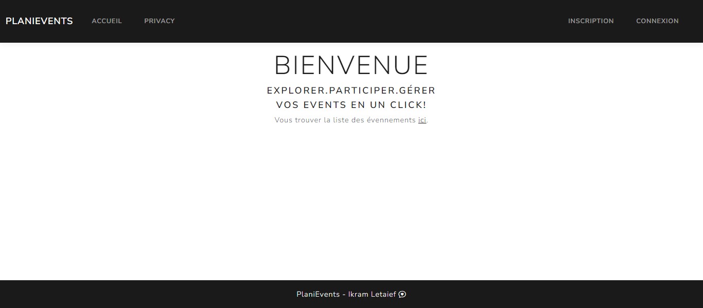
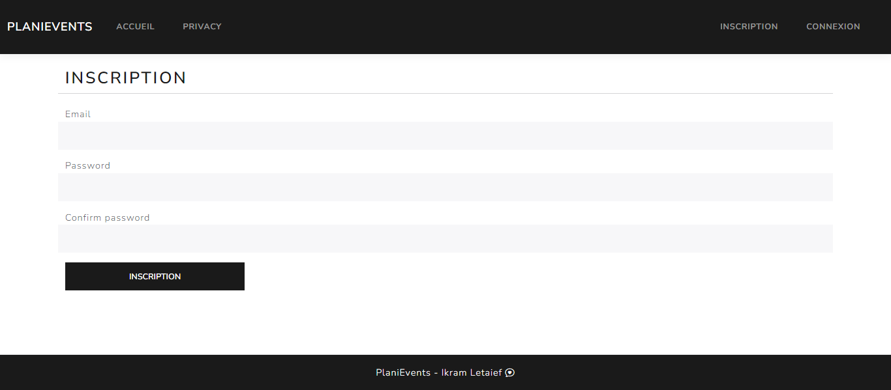
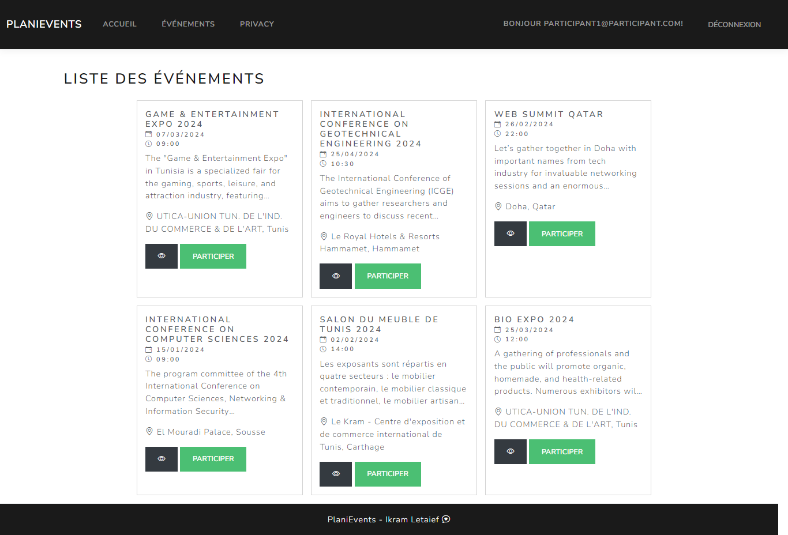
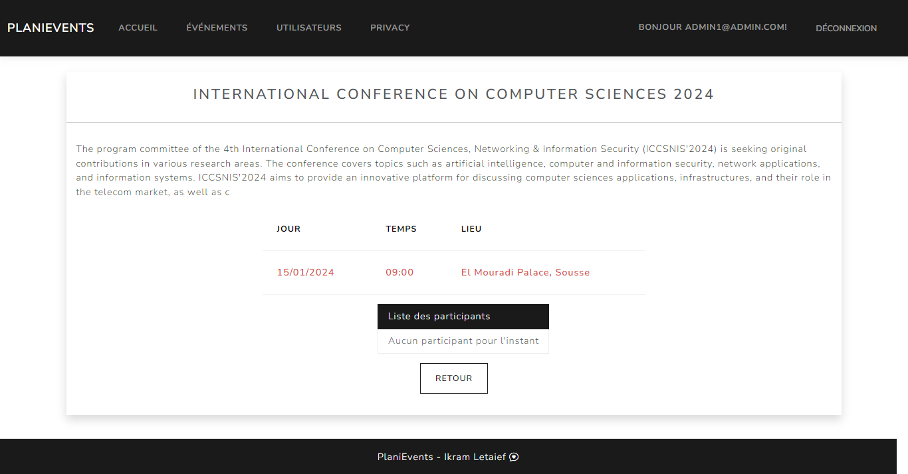
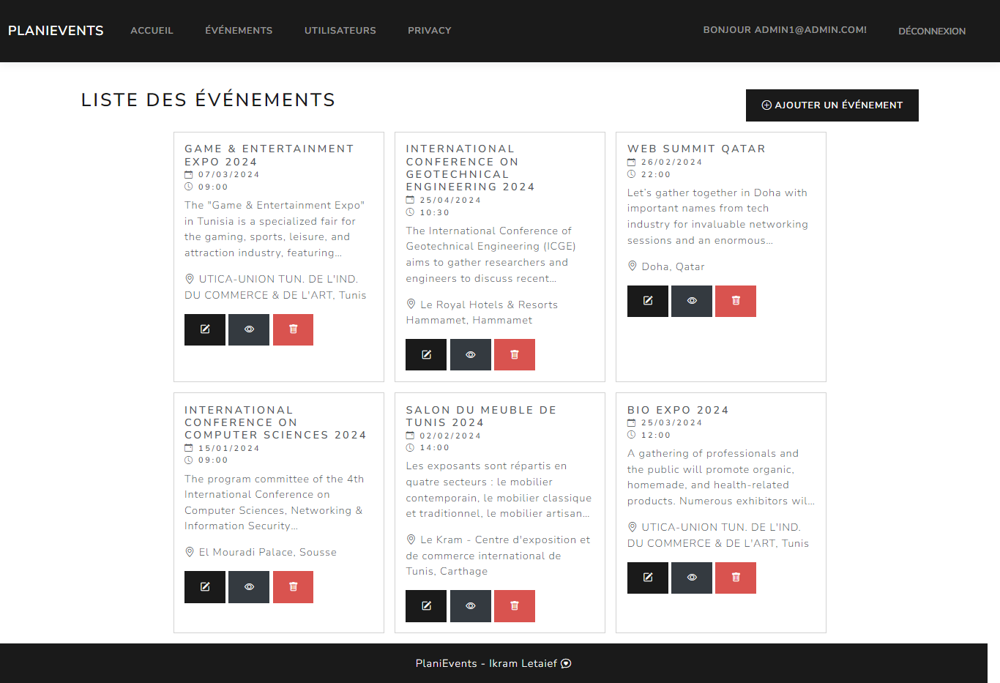
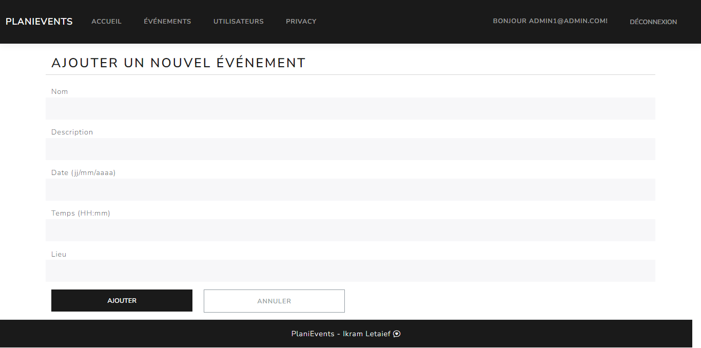
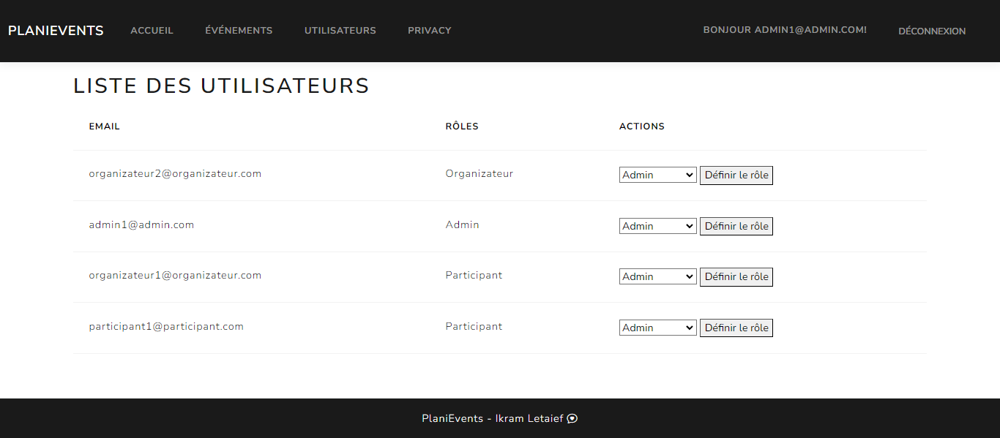

Interfaces application:\
\*Interface d'acceuil:

\*Interface d'inscription:!
\
\*Interface de connexion:
.png>)
\*Interface des évennements(simple utilisateur):

\*Interface detailles évennement:

\*Interface des évennements(admin et super admin/organizateur):

\*Interfaces de gestion des évennements(admin+super-admin/organizateur)
\*creation:

\*modification:
.png>)
\*Interfaces de gestion des utilisateurs(admin)

